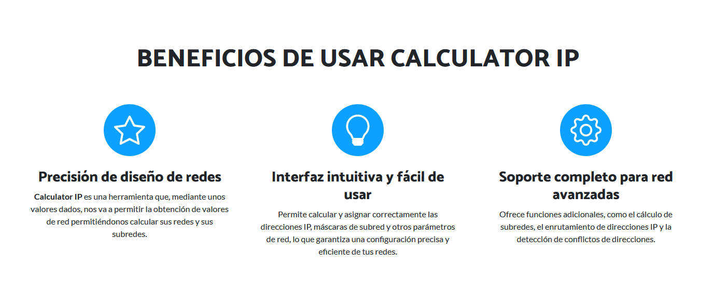
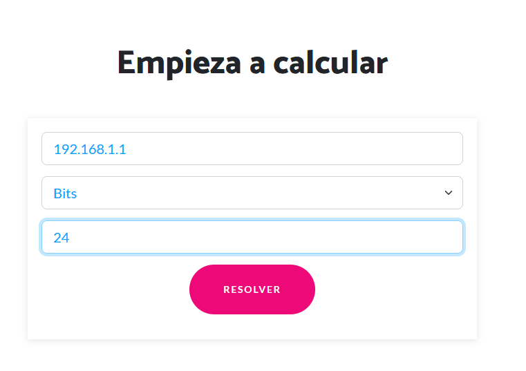
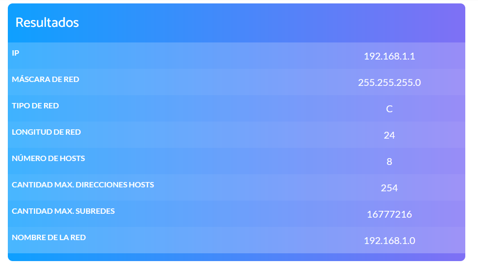
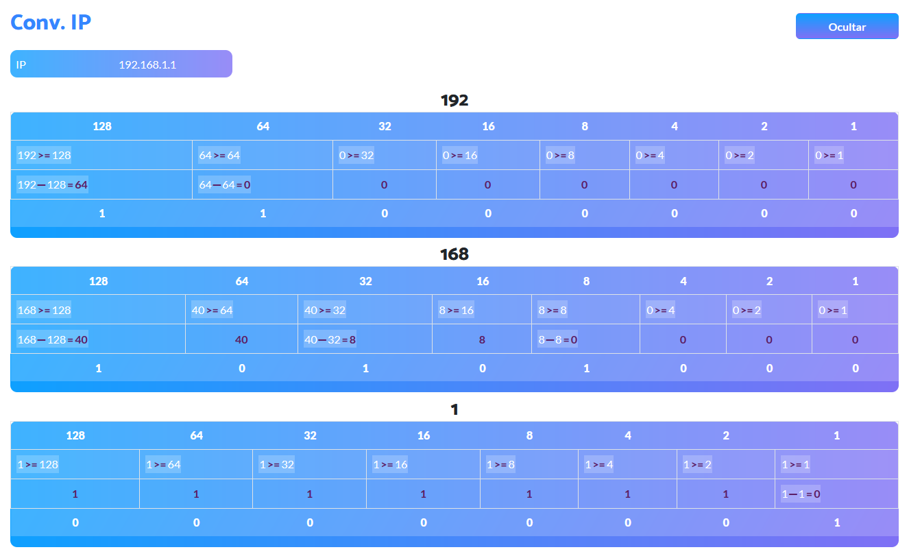
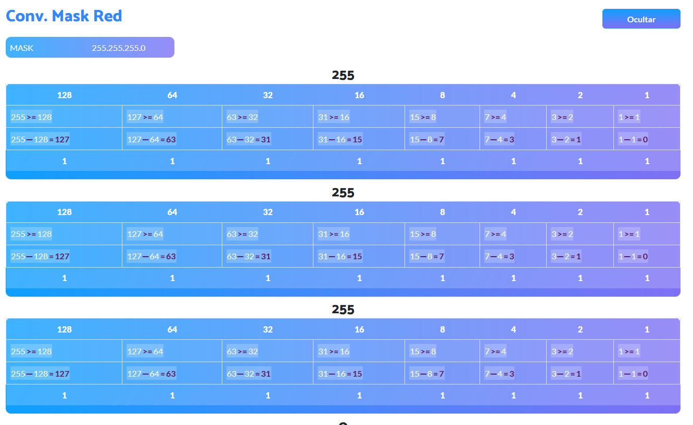
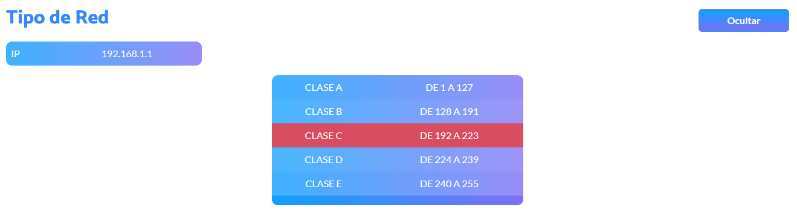
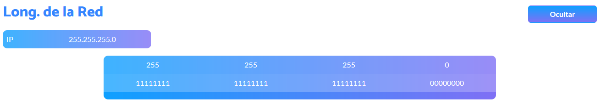
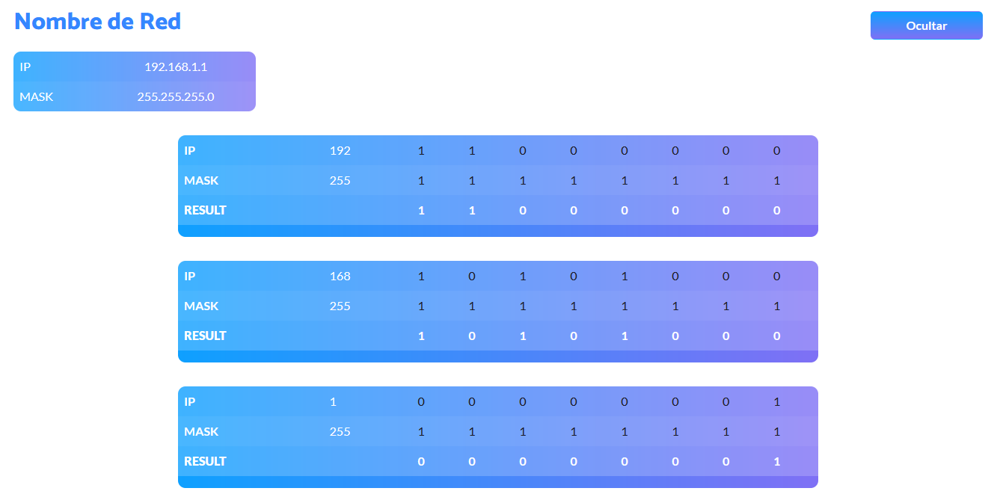

# Calculadora de IP


## Descripción

La Calculadora de IP es una aplicación web construida con React Vite que te permite realizar cálculos relacionados con
direcciones IP, subredes y más.

## Características

- **Cálculos Precisos:** Realiza cálculos precisos de direcciones IP, máscaras de subred y más.
- **Diseño Responsivo:** Interfaz fácil de usar que funciona en dispositivos de todos los tamaños.
- **Visualización Clara:** Muestra resultados de manera clara para una fácil interpretación.

## Uso

**Clonar el Repositorio:**

```bash
git clone https://github.com/OmerJuve2023/calculadora-ip.git
   ```

### Instalar Dependencias

```shell
cd calculadora-ip
```

```npm
npm install
```

### Ejecutar la aplicación

 ```shell 
 npm run dev
```

La aplicación estará disponible en http://calculadoraip.me/calculadora-ip/

## Capturas de Pantalla











## Contribuciones

¡Contribuciones son bienvenidas! Si tienes ideas para mejorar la calculadora, por favor abre un issue o envía un pull
request.
Licencia

**Este proyecto está licenciado bajo la Licencia MIT - consulta el archivo LICENSE para más detalles.**